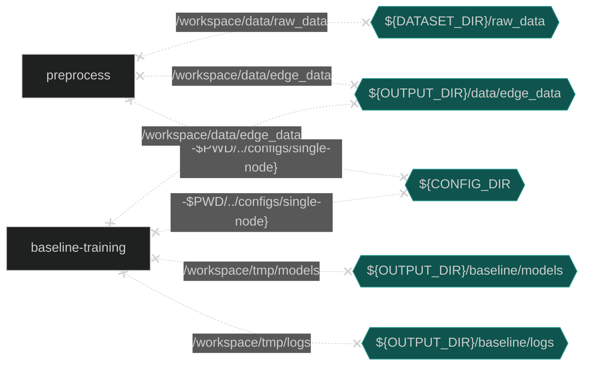

# Enhanced Fraud Detection using Graph Neural Networks
Boost fraud detection accuracy and developer efficiency through Intel's end-to-end, no-code, graph-neural-networks-boosted and multi-node distributed workflows.
Check out more workflow examples and reference implementations in the [Developer Catalog](https://developer.intel.com/aireferenceimplementations).
## **Table of Contents**
- [Overview](#overview)
- [Hardware requirements](#hardware-requirements)
- [How It Works](#how-it-works)
- [Getting Started](#getting-started)
- [Set Up and Run Single Node Pipeline with Docker](#set-up-and-run-single-node-pipeline-with-docker)
- [Developer Containers for Advanced Users](#developer-containers-for-advanced-users)
- [Run Docker Image in an Interactive Environment](#run-docker-image-in-an-interactive-environment)
- [Run Using Argo Workflows on K8s Using Helm](#run-using-argo-workflows-on-k8s-using-helm)
- [Set Up and Run Distributed Pipeline](#set-up-and-run-distributed-pipeline)
- [Expected Output](#expected-output)
- [Summary and Next Steps](#summary-and-next-steps)
  - [Bring your own - dataset, preprocessing, GNN or XGB model](#customize-our-reference-kit-to-suit-your-usecase)
- [Learn More](#learn-more)
- [Support](#support)
## Overview
Fraud detection has traditionally been tackled with classical machine learning algorithms such as gradient boosted machines. However, such supervised machine learning algorithms can lead to unsatisfactory precision and recall due to a few reasons:
- Severe class imbalance: ratio of fraud to non-fraud transactions is extremely imbalanced with typical values less than 1% 
- Complex fraudster behavior which evolves with time: it is quite difficult to capture user behavior using traditional ML techniques 
- Scale of data: credit card transaction datasets can have billions of transactions which require distributed preprocessing and training 
- Latency of fraud detection: it is important to detect fraud quickly in order to minimize losses, thus highlighting the need for distributed inference <br />
In Intel's Enhanced Fraud Detection reference kit, we employ Graph Neural Networks (GNN) popular for their ability to capture complex behavioral patterns (e.g., fraudsters performing multiple small transactions from different cards to not get caught). We also demonstrate a boost in accuracy by using GNN-boosted features over a baseline trained on traditional ML-only features. 
To make sure that we don't trade efficiency for accuracy, we enable distributed pipelines. Generally, distributed pipelines take weeks for data scientists to set up and involve numerous technical challenges. Our reference kit allows you to easily benefit from distributed capabilities and enjoy our no-code config-driven user interface. Additionally, we also provide ways for you to customize our solution to your own usecases.
### Highlights of Enhanced Fraud Detection Reference Use Case
- Significantly boost fraud classification accuracy by augmenting classical ML features with features generated through Graph Neural Networks (GNNs) 
- Utilize our distributed preprocessing, training and inference pipelines to detect fraud quickly
- Improve developer efficiency and experimentation with our no-code, config-driven user interface
To learn more, visit the [Credit Card Fraud Detection](https://github.com/intel/credit-card-fraud-detection) GitHub repository.
## Software Requirements 
Linux OS (Ubuntu 22.04) is used in this reference solution. Make sure the following dependencies are installed.
```bash
sudo apt update 
```
## Hardware Requirements
| Supported Hardware         | Precision  |
| ---------------------------- | ---------- |
| Intel® 1st, 2nd, 3rd, and 4th Gen Xeon® Scalable Performance processors | FP32 |
|Memory|>200GB|
|Storage|>50GB|
### Requirements for distributed pipelines
To benefit from our distributed pipeline, please ensure that -
1. Password-less ssh is set up on all the nodes.
2. A network file system (NFS) is set up for all the nodes to access. 
3. A high-speed network between nodes is set up.
4. A RAM of at least 384 GB. 
5. Storage space of at least 200 GB on localdisk of all nodes. 
## How It Works
The high-level architecture of the reference use case is shown in the diagram below. We use a credit card transaction dataset open-sourced by IBM (commonly known as the tabformer dataset) in this reference use case to demonstrate the capabilities outlined in the Overview section. 


### Task 1: Feature Engineering (Edge Featurization)
The feature engineering stage ingests the raw data, encodes each column into features using the logic defined in the feature engineering config yaml file and saves processed data. 
### Task 2: GNN Training (Node Featurization)
The GNN training stage creates homogenous graphs by consuming the processed data generated by Task 1 and trains a GraphSage model in a self-supervised link prediction task setting to learn the latent representations of the nodes (cards and merchants).  Once the GNN model is trained, the GNN workflow will concatenate the card and merchant features generated by the model to the corresponding transaction features and saves the GNN-boosted features to a CSV file.
### Task 3: XGBoost Training (Fraud Classification)
The XGBoost training stage trains a binary classification model using the data splitting, model parameters and runtime parameters set in the XGB training config yaml file. AUCPR (Area Under the Precision-Recall Curve) is used as the evaluation metric due to its robustness in evaluating highly imbalanced datasets. Data splitting is based on temporal sequence to simulate real-life scenario. The model performance on the tabformer dataset can be found in the table in [results section](#1-results). 

## Getting Started
### 1. Set up the working directory 
Create a working directory for the use case. Use these commands to set up the log folder, data folder and corresponding subfolders inside the working directory. We assume that your working directory is work. 
```bash
export WORKDIR=$PWD/work
mkdir work && cd work
mkdir data ml_tmp gnn_tmp
cd data
mkdir raw_data edge_data node_edge_data
```
Note : If you're running distributed pipeline, please repeat this step on localdisk of all nodes and on NFS. 
### 2. Download the Dataset 
How to get the tabformer dataset -
1. Download the transactions.tgz from https://github.com/IBM/TabFormer/tree/main/data/credit_card
2. Upload the transactions.tgz file to the `$WORKDIR/data/raw_data` folder in your working directory
3. Unzip the transactions.tgz file
```bash
cd $WORKDIR/data/raw_data
tar -zxvf transactions.tgz
```
Note : If you're running distributed pipeline, please repeat this step on localdisk of all nodes and on NFS. </br>
If you want to bring your own dataset, put your raw data in the `$WORKDIR/data/raw_data` folder.  
### 3. Download Fraud Detection Use Case Repository
Clone the repository into your working directory. 
```bash
cd $WORKDIR
git clone https://github.com/intel/credit-card-fraud-detection
cd fraud-detection-usecase
git submodule update --init --recursive
```
Note : If you're running distributed pipeline, please repeat this step on localdisk of master node and on NFS. </br>
Your folder structure should follow the directory structure as shown in the figure below. 

### Ways to run this reference use case
1. [Run with Docker on single node](#set-up-and-run-single-node-pipeline-with-docker)
2. [Run distributed pipelines](#set-up-and-run-distributed-pipeline) </br>
For advanced users, we provide options below:
1. [Developer containers for advanced users](#developer-containers-for-advanced-users)
2. [Run Docker Image in an Interactive Environment](#run-docker-image-in-an-interactive-environment)
3. [Run Using Argo Workflows on K8s Using Helm](#run-using-argo-workflows-on-k8s-using-helm)
---
## Set Up and Run Single Node Pipeline with Docker
To run distributed pipelines, please refer to [Run distributed pipelines](#set-up-and-run-distributed-pipeline). For advanced users, you can use [interactive mode](#run-docker-image-in-an-interactive-environment) to run the workflow containers. You can also check out the [Developer containers for advanced users](#dev-container) section to change the source code in the workflow containers to adapt to your own use case.
### 1. Set Up Docker Engine and Docker Compose
You'll need to install Docker Engine on your development system.
Note that while **Docker Engine** is free to use, **Docker Desktop** may require
you to purchase a license.  See the [Docker Engine Server installation
instructions](https://docs.docker.com/engine/install/#server) for details.
To build and run this workload inside a Docker Container, ensure you have Docker Compose installed on your machine. If you don't have this tool installed please consult official [Docker Compose installation documentation](https://docs.docker.com/compose/install/linux/#install-the-plugin-manually).
```bash
DOCKER_CONFIG=${DOCKER_CONFIG:-$HOME/.docker}
mkdir -p $DOCKER_CONFIG/cli-plugins
curl -SL https://github.com/docker/compose/releases/download/v2.7.0/docker-compose-linux-x86_64 -o $DOCKER_CONFIG/cli-plugins/docker-compose
chmod +x $DOCKER_CONFIG/cli-plugins/docker-compose
docker compose version
```
### 2. Setup Dataset
Ensure you have downloaded the dataset as described in [Prepare data directory](#2-download-the-dataset) and set the path to the dataset as described below.
```bash
# pass the absolute path to /work/data folder
export DATASET_DIR=<path-to-data-dir>
```
### 3. Set Up Docker Image
You can choose to pull or build the containers that are going to be used to run the pipeline.
```bash
cd docker
docker compose build
```
OR
```bash
cd docker
docker pull intel/ai-workflows:beta-fraud-detection-classical-ml
docker pull intel/ai-workflows:beta-fraud-detection-gnn
```
Note : if you're running distributed pipeline, pull the classical-ml docker image on all nodes. 
### 4. Run single node pipeline
#### Step 1: Run Feature Engineering to get edge features
Run the preprocessing using the following command:
```bash
docker compose run preprocess 2>&1 | tee preprocess.log
```
The `preprocess` workflow will ingest the raw data in the `$DATASET_DIR/raw_data/card_transaction.v1.csv` directory, generate a preprocessed CSV file, and save it in the `$OUTPUT_DIR/data/edge_data/` directory. 
The table below shows some of the environment variables you can control according to your needs.
| Environment Variable Name | Default Value | Description |
| --- | --- | --- |
| CONFIG_DIR | `$PWD/../configs/single-node` | Directory of the config file |
| OUTPUT_DIR | `$PWD/output` | Output Preprocessed Dataset directory. |
#### Step 2: Train and evaluate XGBoost baseline model with edge features only for fraud classification
The preprocess pipeline must complete successfully before running the baseline training. The preprocess pipeline generates an output CSV file at `$OUTPUT_DIR/data/edge_data/`.
The `baseline-training` workflow will consume the CSV file generated from `preprocess` above, and run a training of a XGBoost model. It will also print out AUCPR (area under the precision-recall curve) results to the console. 



Run the workflow container with the command below.
```bash
docker compose run baseline-training 2>&1 | tee baseline-training.log
```
The table below shows some of the environment variables you can control according to your needs.
| Environment Variable Name | Default Value | Description |
| --- | --- | --- |
| CONFIG_DIR | `$PWD/../configs/single-node` | Directory of the config file |
| OUTPUT_DIR | `$PWD/output` | Output directory. Should be the same as set in [Step-2](#step-2-train-and-evaluate-xgboost-baseline-model-with-edge-features-only-for-fraud-classification)  |
#### Step 3: Train and Evaluate XGBoost with both edge features and GNN generated node features for Fraud Classification
To see the improvement over the baseline training you can run the xgb-training pipeline. Before running the baseline training, the preprocess pipeline must complete successfully. The preprocess pipeline generates an output CSV file at `$OUTPUT_DIR/data/edge_data/`. The `xgb-training` workflow consumes the CSV file generated from `preprocess` above, runs the `gnn-analytics` pipeline to generate optimized features, and runs a training of a XGBoost model using these features. It will also print out AUCPR (area under the precision-recall curve) results to the console.

Note : as this step runs GNN training first, we don't expect to see output for a while. Once GNN training finishes, we will start seeing output from XGBoost training. Instructions to check GNN log are provided in [logs section](#5-logs).

```mermaid
%%{init: {'theme': 'dark'}}%%
flowchart RL
  VDATASETDIRrawdata{{"${DATASET_DIR}/raw_data"}} x-. /workspace/data/raw_data .-x preprocess
  VOUTPUTDIRdataedgedata{{"${OUTPUT_DIR}/data/edge_data"}} x-. /workspace/data/edge_data .-x preprocess
  VCONFIGDIR{{"${CONFIG_DIR"}} x-. "-$PWD/../configs/single-node}" .-x preprocess
  VOUTPUTDIRdataedgedataprocesseddatatrimmedcsv{{"${OUTPUT_DIR}/data/edge_data/processed_data_trimmed.csv"}} x-. /DATA_IN/processed_data.csv .-x gnnanalytics[gnn-analytics]
  VOUTPUTDIRdatanodeedgedata{{"${OUTPUT_DIR}/data/node_edge_data"}} x-. /DATA_OUT .-x gnnanalytics
  VOUTPUTDIRgnncheckpoint{{"${OUTPUT_DIR}/gnn_checkpoint"}} x-. /GNN_TMP .-x gnnanalytics
  VCONFIGDIR x-. "-$PWD/../configs/single-node}" .-x gnnanalytics
  VOUTPUTDIRdatanodeedgedata x-. /workspace/data/node_edge_data .-x xgbtraining[xgb-training]
  VOUTPUTDIRxgbtrainingmodels{{"${OUTPUT_DIR}/xgb-training/models"}} x-. /workspace/tmp/models .-x xgbtraining
  VOUTPUTDIRxgbtraininglogs{{"${OUTPUT_DIR}/xgb-training/logs"}} x-. /workspace/tmp/logs .-x xgbtraining
  VCONFIGDIR x-. "-$PWD/../configs/single-node}" .-x xgbtraining
  xgbtraining --> gnnanalytics

  classDef volumes fill:#0f544e,stroke:#23968b
  class VDATASETDIRrawdata,VOUTPUTDIRdataedgedata,VCONFIGDIR,VOUTPUTDIRdataedgedataprocesseddatatrimmedcsv,VOUTPUTDIRdatanodeedgedata,VOUTPUTDIRgnncheckpoint,VCONFIGDIR,VOUTPUTDIRdatanodeedgedata,VOUTPUTDIRxgbtrainingmodels,VOUTPUTDIRxgbtraininglogs,VCONFIGDIR volumes
```

Run the workflow container with the command below.
```bash
docker compose run xgb-training 2>&1 | tee xgb-training.log
```
This command runs the `gnn-analytics` pipeline to generate the node features first and then uses edge features generated from [Step 2](#step-2-train-and-evaluate-xgboost-baseline-model-with-edge-features-only-for-fraud-classification) to train the XGBoost model and will print out AUCPR (area under the precision-recall curve) results to the console.

Note : This steps runs the GNN training first which can take several hours to finish. 


The table below shows some of the environment variables you can control according to your needs.
| Environment Variable Name | Default Value | Description |
| --- | --- | --- |
| CONFIG_DIR | `$PWD/../configs/single-node` | Directory of the config file |
| OUTPUT_DIR | `$PWD/output` | Dataset, Logfile and Checkpoint output. Should contain `${OUTPUT_DIR}/data/edge_data/processed_data.csv`  |
### 5. Logs
You can also check logs of different pipelines using the following commands.
```bash
docker compose logs gnn-analytics -f
```
Run these commands to check the preprocess, baseline, and xgb-training logs:
```bash
cat preprocess.log
cat baseline-training.log
cat xgb-training.log
```
## Developer containers for advanced users
If you want to edit and run your own version of a workflow with the same docker containers you can use the dev pipelines below. The environment variables you can control are described below. 
### Developer Baseline Container
This pipeline allows you to control the source code, scripts, and parameters for running the baseline XGBoost pipeline. This takes a preprocess dataset and trains an XGBoost model.
```bash
docker compose run dev-baseline-training
```
| Environment Variable Name | Default Value | Description |
| --- | --- | --- |
| CONFIG_DIR | `$PWD/../configs/single-node` | Directory of the config file |
| OUTPUT_DIR | `$PWD/output` | Dataset, Logfile and Checkpoint output. Should contain `${OUTPUT_DIR}/data/edge_data/processed_data.csv`  |
| PARAMETER | `--baseline-training` | Script file parameter to control which pipeline to run from (--baseline-training/--gnn-analytics/--xgb-training) |
| SCRIPT | `/fraud-detection/wrapper.sh` | Path of Script inside the container.|
| WORKSPACE | `$PWD/../classical-ml` | Submodule Location of the classical-ml |
### Developer GNN Container
This pipeline allows you to control the source code, scripts, and parameters for running the GNN Analytics pipeline. This takes a preprocess dataset and generates the node features described in [GNN Training](#task-2-gnn-training-node-featurization).
```bash
docker compose run dev-gnn-analytics
```
| Environment Variable Name | Default Value | Description |
| --- | --- | --- |
| CONFIG_DIR | `$PWD/../configs/single-node` | Directory of the config file |
| OUTPUT_DIR | `$PWD/output` | Dataset, Logfile and Checkpoint output. Should contain `${OUTPUT_DIR}/data/edge_data/processed_data.csv`  |
| PARAMETER | `--gnn-analytics` | Script file parameter to control which pipeline to run from (--baseline-training/--gnn-analytics/--xgb-training) |
| SCRIPT | `/fraud-detection/wrapper.sh` | Path of Script inside the container.|
| WORKSPACE | `$PWD/../gnn-analytics` | Submodule Location of the gnn-workflow|
### Developer XGBoost Training Container
This pipeline allows you to control the source code, scripts, and parameters for running the GNN Boosted XGBoost training pipeline. This takes the GNN boosted dataset and runs the training described in [XGBoost Training](#task-3-xgboost-training-fraud-classification).
```bash
docker compose run dev-xgb-training
```
| Environment Variable Name | Default Value | Description |
| --- | --- | --- |
| CONFIG_DIR | `$PWD/../configs/single-node` | Directory of the config file |
| OUTPUT_DIR | `$PWD/output` | Dataset, Logfile and Checkpoint output. Should contain `${OUTPUT_DIR}/data/edge_data/processed_data.csv`  |
| PARAMETER | `--xgb-training` | Script file parameter to control which pipeline to run from (--baseline-training/--gnn-analytics/--xgb-training) |
| SCRIPT | `/fraud-detection/wrapper.sh` | Path of Script inside the container.|
| WORKSPACE | `$PWD/../classical-ml` | Submodule Location of the classical-ml |
## Clean Up Docker Containers
Run the following command to stop all services and containers created by docker compose and remove them.
```bash
docker compose down
```
## Run Docker Image in an Interactive Environment
You can also choose to run the container in an interactive manner to execute the workflows manually after getting inside the containers.
If your environment requires a proxy to access the internet, export your development system's proxy settings to the docker environment:
```bash
export DOCKER_RUN_ENVS="-e ftp_proxy=${ftp_proxy} \
  -e FTP_PROXY=${FTP_PROXY} -e http_proxy=${http_proxy} \
  -e HTTP_PROXY=${HTTP_PROXY} -e https_proxy=${https_proxy} \
  -e HTTPS_PROXY=${HTTPS_PROXY} -e no_proxy=${no_proxy} \
  -e NO_PROXY=${NO_PROXY} -e socks_proxy=${socks_proxy} \
  -e SOCKS_PROXY=${SOCKS_PROXY}"
```
### Run the baseline-training workflow
Use the following command to run the `baseline-training` workflow container interactively.
```bash
export DATASET_DIR=/path/to/data
export OUTPUT_DIR=$PWD/output
export WORKSPACE=$PWD/../classical-ml
export WRAPPER_SCRIPT=$PWD/../wrapper.sh
export CONFIG_DIR=$PWD/../configs/single-node
docker run -a stdout ${DOCKER_RUN_ENVS} \
           -v ${DATASET_DIR}/raw_data:/fraud-detection/data/raw_data \
           -v ${CONFIG_DIR}:/fraud-detection/configs \
           -v ${OUTPUT_DIR}/data/edge_data:/fraud-detection/data/edge_data \
           -v ${OUTPUT_DIR}/baseline/models:/workspace/tmp/models \
           -v ${WORKSPACE}:/fraud-detection/classical-ml \
           --privileged --init -it --rm --pull always \
           -w /fraud-detection/classical-ml \
           intel/ai-workflows:beta-fraud-detection-classical-ml \
           bash
```
Run the command below for preprocessing and baseline training
```bash
/fraud-detection/wrapper.sh --preprocess --baseline-training
```
## Run Using Argo Workflows on K8s Using Helm
### 1. Install Helm
- Install [Helm](https://helm.sh/docs/intro/install/)
```bash
curl -fsSL -o get_helm.sh https://raw.githubusercontent.com/helm/helm/main/scripts/get-helm-3 && \
chmod 700 get_helm.sh && \
./get_helm.sh
```
### 2. Setting up K8s
- Install [Argo Workflows](https://argoproj.github.io/argo-workflows/quick-start/) and [Argo CLI](https://github.com/argoproj/argo-workflows/releases)
- Configure your [Artifact Repository](https://argoproj.github.io/argo-workflows/configure-artifact-repository/)
### 3. Install Workflow Template
Ensure that you have reviewed the [Hardware Requirements](#hardware-requirements) and each of your nodes has sufficient memory for the GNN workflow.
```bash
export NAMESPACE=argo
helm install --namespace ${NAMESPACE} --set proxy=${http_proxy} fraud-detection ./chart
argo submit --from wftmpl/fraud-detection --namespace=${NAMESPACE}
```
### 4. View 
To view your workflow progress
```bash
argo logs @latest -f
```
## Set up and run distributed pipeline 
### NOTE: Stay Tuned for the distributed pipeline in upcoming weeks!
To run with Docker on single node, refer to [Run with Docker on single node](#set-up-and-run-single-node-pipeline-with-docker).
### 1. Requirements
1. Password-less ssh needs to be set up on all the nodes that you are using. 
2. Classical ML workflow requires code, configs and data directory to reside locally.
3. GNN workflow requires the data directory and code repository to reside on Network File System (NFS).
4. The nodes should be connected with a high-speed network to enjoy speedups.
5. The nodes should have at least 384 GB of RAM, 200 GB free space on localdisk and 50 GB of free space on NFS. 
6. We assume that `work` folder exists at the same location in localdisk of all nodes. (e.g. `/localdisk/john_doe/work` is the location for work folder in all nodes). 
### 2. Set up distributed workflows
#### 1 : Set up classical ML workflow
##### Step 1: set up docker compose (on master node)
You'll need to install Docker Engine on your development system.
Note that while **Docker Engine** is free to use, **Docker Desktop** may require
you to purchase a license.  See the [Docker Engine Server installation
instructions](https://docs.docker.com/engine/install/#server) for details.
To build and run this workload inside a Docker Container, ensure you have Docker Compose installed on your machine. If you don't have this tool installed please consult official [Docker Compose installation documentation](https://docs.docker.com/compose/install/linux/#install-the-plugin-manually).
```bash
# on master node
DOCKER_CONFIG=${DOCKER_CONFIG:-$HOME/.docker}
mkdir -p $DOCKER_CONFIG/cli-plugins
curl -SL https://github.com/docker/compose/releases/download/v2.7.0/docker-compose-linux-x86_64 -o $DOCKER_CONFIG/cli-plugins/docker-compose
chmod +x $DOCKER_CONFIG/cli-plugins/docker-compose
docker compose version
```
##### Step 2: set path to data directory (on master node)
Ensure you have downloaded the dataset as described in [Prepare data directory](#2-download-the-dataset) and set the path to the dataset as described below.
```bash
# pass the absolute path to /work/data folder on localdisk of master node
export DATASET_DIR=<path-to-data-dir>
```
##### Step 3: build docker images using docker compose (on master node)
```bash
# on localdisk of master node
cd <path-to-work-dir-on-localdisk>/fraud-detection-usecase/docker
docker compose build
```
##### Step 4: compress docker image for classical ML workflow (on master node)
```bash
# on master node
docker save -o wf-image.tar intel/ai-workflows:beta-fraud-detection-classical-ml
```
##### Step 5: copy the compressed docker image to worker node (on master node)
```bash
# on master node 
# Note : provide IP address to the worker node
export WORKER_IP = <worker-node-ip>
# Note : provide path to work directory on localdisk of worker node
scp wf-image.tar $WORKER_IP:<path-to-work-dir-on-localdisk>
```
##### Step 6: load the compressed docker image (from master to worker node)
```bash
# from master node, ssh into worker node
ssh $WORKER_IP
# Note : provide path to work directory on localdisk of worker node
docker load -i <path-to-work-dir-on-localdisk>/wf-image.tar 
```
#### 2 : Set up GNN workflow
##### Step 1: set up conda (on NFS)
To learn more, please visit [install anaconda on Linux](https://docs.anaconda.com/free/anaconda/install/linux/). 
```bash
# on NFS
wget https://repo.anaconda.com/archive/Anaconda3-2022.10-Linux-x86_64.sh
bash Anaconda3-2022.10-Linux-x86_64.sh
```
### 3. Run the Distributed Workflows
We allow the users to bring their own dataset, create their own preprocessing engine, build custom graph dataset from processed csv files as well as construct their own XGBoost and GraphSage model. Please find more information in [Customize our reference kit to your own usecase](#customize-our-reference-kit-to-suit-your-usecase). 
#### Step 1: Run distributed preprocessing (on localdisk)
1. On master node, prepare `<path-to-work-dir-on-localdisk>/fraud-detection-usecase/configs/distributed/workflow-data-preprocessing.yaml` to reflect desired IP addresses and absolute path to work dir on localdisk. </br>
```bash
env:
  num_node: 2
  node_ips: #the first item in the ip list is the master ip, pls make sure that the ip doesn't contain space in the end
    - IP1
    - IP2
  # NOTE : please provide absolute path to work dir on localdisk
  tmp_path: <path-to-work-dir-on-localdisk>/ml_tmp  
  data_path: <path-to-work-dir-on-localdisk>/data
  config_path: <path-to-work-dir-on-localdisk>/fraud-detection-usecase/configs/distributed
``` 
2. Pass the workflow config yaml to the Classical ML workflow container and launch the workflow container from master node with the command below. 
```bash
# on master node 
cd <path-to-work-dir-on-localdisk>/fraud-detection-usecase/classical-ml
./run-workflow.sh <path-to-work-dir-on-localdisk>/fraud-detection-usecase/configs/distributed/workflow-data-preprocessing.yaml
```
The Classical ML workflow saves the processed data inside `/work/data/edge_data` folder on the local disk of the master node. After a successful run, `/work/data/edge_data/processed_data.csv` should have (24198836, 26) shape. 
#### Step 2: Train distributed baseline model - edge features only (on localdisk)
1. On master node, prepare `<path-to-work-dir-on-localdisk>/fraud-detection-usecase/configs/distributed/workflow-baseline.yaml` to reflect desired IP addresses and absolute path to work dir on localdisk. </br>
```bash
env:
  num_node: 2
  node_ips: #the first item in the ip list is the master ip, pls make sure that the ip doesn't contain space in the end
    - IP1
    - IP2
  # NOTE : please provide absolute path to work dir on localdisk
  tmp_path: <path-to-work-dir-on-localdisk>/ml_tmp  
  data_path: <path-to-work-dir-on-localdisk>/data
  config_path: <path-to-work-dir-on-localdisk>/fraud-detection-usecase/configs/distributed
```
2. Pass the workflow config yaml to the Classical ML workflow container and run the workflow container with the command below.
```bash
# on master node
cd <path-to-work-dir-on-localdisk>/fraud-detection-usecase/classical-ml
./run-workflow.sh <path-to-work-dir-on-localdisk>/fraud-detection-usecase/configs/distributed/workflow-baseline.yaml
```
#### Step 3. Train distributed Graph Neural Network to get node features (on NFS)
1. Copy the processed data from localdisk of master node to NFS. 
```bash
# on master node 
scp <path-to-work-dir-on-localdisk>/data/edge_data/processed_data.csv <path-to-work-dir-on-NFS>/data/edge_data/
```
2. On master node, prepare `<path-to-work-dir-on-NFS>/fraud-detection-usecase/configs/distributed/workflow-gnn-training.yaml` to reflect desired IP addresses and absolute path to work dir on NFS. </br>
```bash
env:
  num_node: 2
  node_ips: 
    - IP1
    - IP2
  # NOTE : please provide absolute path to work dir on NFS
  # tmp_path used to save model, embeddings, partitions...
  tmp_path: <path-to-work-dir-on-NFS>/gnn_tmp
  # data_path should contain processed_data.csv
  data_path: <path-to-work-dir-on-NFS>/data/edge_data
  # in_data_filename is the name of input csv file
  in_data_filename: processed_data.csv
  # out_path will contain the output csv with the tabular data and new node embeddings
  out_path: <path-to-work-dir-on-NFS>/data/node_edge_data
  #config_path will contain all three configs required by GNN workflow
  config_path: <path-to-work-dir-on-NFS>/fraud-detection-usecase/configs/distributed
```
3. Pass the workflow config yaml to the Classical ML workflow container and run the workflow container with the command below.
```bash
# on master node
cd <path-to-work-dir-on-NFS>/fraud-detection-usecase/gnn-analytics
./run-workflow.sh <path-to-work-dir-on-NFS>/fraud-detection-usecase/configs/distributed/workflow-gnn-training.yaml
```
Distributed GNN workflow will save GNN-boosted features to `/work/data/node_edge_data/` folder on NFS. After a successful run, `/work/data/node_edge_data/tabular_with_gnn_emb.csv` should have (24198836, 154) shape. 
#### Step 4. Distributed XGBoost training for fraud classification (on localdisk)
1. Copy GNN-boosted data from NFS to localdisk on master node. 
```bash
# on master node
scp <path-to-work-dir-on-NFS>/data/node_edge_data/tabular_with_gnn_emb.csv <path-to-work-dir-on-localdisk>/data/node_edge_data/
```
2. On master node, prepare `<path-to-work-dir-on-localdisk>/fraud-detection-usecase/configs/distributed/workflow-xgb-training.yaml` to reflect desired IP addresses and absolute path to work dir on localdisk. </br>
```bash
env:
  num_node: 2
  node_ips: #the first item in the ip list is the master ip, pls make sure that the ip doesn't contain space in the end
    - IP1
    - IP2
  # NOTE : please provide absolute path to work dir on localdisk
  tmp_path: <path-to-work-dir-in-localdisk>/ml_tmp 
  data_path: <path-to-work-dir-in-localdisk>/data
  config_path: <path-to-work-dir-in-localdisk>/fraud-detection-usecase/configs/distributed
```
3. Pass the workflow config yaml to the Classical ML workflow container and run the workflow container with the command below.
```bash
# on master node in localdisk
cd <path-to-work-dir-in-localdisk>/fraud-detection-usecase/classical-ml
./run-workflow.sh <path-to-work-dir-in-localdisk>/fraud-detection-usecase/configs/distributed/workflow-xgb-training.yaml
```
---
## Expected output 
### 1: Results 
We use Area Under the Precision Recall Curve (AUCPR) as evaluation metric (lies between 0 and 1, higher is better). 
#### Results for single node pipeline
You should expect to see a boost in AUCPR for test split by using GNN-boosted features. 
| Data split                     | Number of examples   | AUCPR - Edge features only   | AUCPR - GNN-boosted features   |
| :----------------------------: | :-----------------------: | :-------------------------: | :----------------------------: |
|   Train (year < 2018)          |     20,604,847            |            0.92             |           0.98                 |
|    Val (year = 2018)           |      1,689,822            |            0.91             |           0.93                 |
|   Test (year > 2018)           |      1,904,167            |            0.88             |           0.94                 |
#### Results for distributed pipeline
You should expect to see a boost in AUCPR for test split by using GNN-boosted features. 
| Data split                     | Number of examples   | AUCPR - Edge features only   | AUCPR - GNN-boosted features   |
| :----------------------------: | :-----------------------: | :-------------------------: | :----------------------------: |
|   Train (year < 2018)          |     20,604,847            |            0.95             |           0.96                 |
|    Val (year = 2018)           |      1,689,822            |            0.90             |           0.93                 |
|   Test (year > 2018)           |      1,904,167            |            0.88             |           0.94                 |
### 2: Expected output for single node pipeline 
You will see logs that look similar to the ones below once you run the use case successfully. Please note that the timing numbers depend on the hardware systems.
#### Expected output for single node preprocessing
```
Preprocessing dataset
Failed to read model training configurations. This is either due to wrong parameters defined in the config file as shown: 'training'
Or there is no need for model training.
enter single-node mode...
reading data...
(24386900, 15)
preparing data...
engineering features...
splitting data...
encoding features...
saving data...
data saved under the path /fraud-detection/data/edge_data/processed_data.csv
```
#### Expected output for single node baseline (with automated hyperparameter optimization)
Our workflow runs hyperparameter optimization by default and prints the best trial's hyperparameters. 
```
Failed to read data preprocessing steps. This is either due to wrong parameters defined in the config file as shown: 'data_preprocess' or there is no need for data preprocessing.
no need for training Failed to read end2end training configurations. This is either due to wrong parameters defined in the config file as shown: 'end2end_training' or there is no need for End-to-End training.
enter single-node mode...
reading training data...
reading without dropping columns...
data has the shape (24198836, 26)
start training models soon...
(24198836, 22)
read and prepare data for training...
start xgboost HPO...
  0%|          | 0/10 [00:00<?, ?it/s][0]       train-aucpr:0.39670     eval-aucpr:0.26043      test-aucpr:0.26432
[999]   train-aucpr:0.98697     eval-aucpr:0.87243      test-aucpr:0.81485
Best trial: 0. Best value: 0.872425:  10%|â–ˆ         | 1/10 [22:23<3:21:33, 1343.71s/it][I 2023-04-26 23:19:42,948] Trial 0 finished with value: 0.8724252645144079 and parameters: {'eta': 0.15, 'max_depth': 7, 'subsample': 0.5580179751710447, 'colsample_bytree': 0.8829791679963901, 'lambda': 0.6988028968743126, 'alpha': 0.9281407432733514, 'min_child_weight': 2}. Best is trial 0 with value: 0.8724252645144079.
...
[0]     train-aucpr:0.20233     eval-aucpr:0.11631      test-aucpr:0.11132
[999]   train-aucpr:0.93912     eval-aucpr:0.88756      test-aucpr:0.81800
Best trial: 7. Best value: 0.91189: 100%| 10/10 [3:32:04<00:00, 1272.49s/it]
Trial 9 finished with value: 0.8875619161413042 and parameters: {'eta': 0.17, 'max_depth': 5, 'subsample': 0.8748137912212397, 'colsample_bytree': 0.9733703420536219, 'lambda': 0.565297835149586, 'alpha': 0.43564481669099264, 'min_child_weight': 2}. 
Best is trial 7 with value: 0.9118896651018639.
  Value: 0.9118896651018639
  Params:
    eta: 0.1
    max_depth: 9
    subsample: 0.6372646065696512
    colsample_bytree: 0.5940969469756718
    lambda: 0.023810403412340413
    alpha: 0.4955030354495986
    min_child_weight: 9
aucpr of the best configs on test set is 0.8779567630966963
```
#### Expected output for single node baseline (with best hyperparameters)
We saved our best model's hyper-parameters in `$WORKDIR/fraud-detection-usecase/configs/single-node/baseline-xgb-training.yaml`. Simply comment `hpo_spec` section and uncomment `model_spec` section to reproduce our results. 
```
Failed to read data preprocessing steps. This is either due to wrong parameters defined in the config file as shown: 'data_preprocess' or there is no need for data preprocessing.
no need for HPO
Failed to read end2end training configurations. This is either due to wrong parameters defined in the config file as shown: 'end2end_training' or there is no need for End-to-End training.
enter single-node mode...
reading training data...
reading without dropping columns...
data has the shape (24198836, 26)
start training models soon...
(24198836, 22)
read and prepare data for training...
start xgboost model training...
[0]     train-aucpr:0.41938     eval-aucpr:0.41885      test-aucpr:0.36533
[100]   train-aucpr:0.78485     eval-aucpr:0.90691      test-aucpr:0.89396
[200]   train-aucpr:0.81402     eval-aucpr:0.92188      test-aucpr:0.89991
[300]   train-aucpr:0.84193     eval-aucpr:0.92164      test-aucpr:0.89123
[400]   train-aucpr:0.86475     eval-aucpr:0.91879      test-aucpr:0.88308
[500]   train-aucpr:0.87911     eval-aucpr:0.91601      test-aucpr:0.87810
[600]   train-aucpr:0.88980     eval-aucpr:0.91699      test-aucpr:0.87880
[700]   train-aucpr:0.89974     eval-aucpr:0.91588      test-aucpr:0.88025
[800]   train-aucpr:0.90777     eval-aucpr:0.91510      test-aucpr:0.87856
[900]   train-aucpr:0.91517     eval-aucpr:0.91347      test-aucpr:0.87711
[999]   train-aucpr:0.92204     eval-aucpr:0.91267      test-aucpr:0.87582
start xgboost model testing...
testing results: aucpr on test set is 0.8758093307052992
xgboost model is saved under /workspace/tmp/models.
```
#### Expected output for single node GNN and XGB training (with automated hyperparameter optimization)
Our workflow runs hyperparameter optimization by default and prints the best trial's hyperparameters. 
```
Creating Container docker-gnn-analytics-1
Created Container docker-gnn-analytics-1
Starting Container docker-gnn-analytics-1

Failed to read data preprocessing steps. This is either due to wrong parameters defined in the config file as shown: 'data_preprocess' or there is no need for data preprocessing.
no need for training Failed to read end2end training configurations. This is either due to wrong parameters defined in the config file as shown: 'end2end_training' or there is no need for End-to-End training.
enter single-node mode...
reading training data...
reading without dropping columns...
data has the shape (24198836, 154)
start training models soon...
(24198836, 150)
read and prepare data for training...
start xgboost HPO...
[0] train-aucpr:0.19283 eval-aucpr:0.03559 test-aucpr:0.02577
[999] train-aucpr:0.94984 eval-aucpr:0.89502 test-aucpr:0.86376
Best trial: 0. Best value: 0.89502: 10%|â–ˆ | 1/10 [17:27<2:37:05, 1047.28s/it][I 2023-04-27 21:51:02,449] Trial 0 finished with value: 0.8950199939942034 and parameters: {'eta': 0.2, 'max_depth': 4, 'subsample': 0.581804256586296, 'colsample_bytree': 0.3397014497235425, 'lambda': 0.4620219935728601, 'alpha': 0.8976349208109945, 'min_child_weight': 3}. Best is trial 0 with value: 0.8950199939942034.
...
Best trial: 5. Best value: 0.930132: 100%| 10/10 [2:48:54<00:00, 1013.50s/it]
[I 2023-04-28 00:22:30,154] Trial 9 finished with value: 0.9054094235120606 and parameters: {'eta': 0.1, 'max_depth': 5, 'subsample': 0.9740220576298498, 'colsample_bytree': 0.5915481518062535, 'lambda': 0.7854898534100563, 'alpha': 0.6962425381327314, 'min_child_weight': 3}.
Best is trial 5 with value: 0.930131689676218.
Value: 0.930131689676218
Params:
eta: 0.01
max_depth: 6
subsample: 0.8714669008983891
colsample_bytree: 0.8825897760478416
lambda: 0.4397103901613584
alpha: 0.8475402634335466
min_child_weight: 8
aucpr of the best configs on test set is 0.9224617296126916
```
#### Expected output for single node GNN and XGB training (with best hyperparameters)
We saved our best model's hyper-parameters in `$WORKDIR/fraud-detection-usecase/configs/single-node/xgb-training.yaml`. Simply comment `hpo_spec` section and uncomment `model_spec` section to reproduce our results. 
```
Failed to read data preprocessing steps. This is either due to wrong parameters defined in the config file as shown: 'data_preprocess' or there is no need for data preprocessing.
no need for HPO
Failed to read end2end training configurations. This is either due to wrong parameters defined in the config file as shown: 'end2end_training' or there is no need for End-to-End training.
enter single-node mode...
reading training data...
reading without dropping columns...
data has the shape (24198836, 154)
start training models soon...
(24198836, 150)
read and prepare data for training...
start xgboost model training...
[0]     train-aucpr:0.48145     eval-aucpr:0.23717      test-aucpr:0.21672
[100]   train-aucpr:0.80701     eval-aucpr:0.84678      test-aucpr:0.83616
[200]   train-aucpr:0.85851     eval-aucpr:0.93348      test-aucpr:0.95080
[300]   train-aucpr:0.88907     eval-aucpr:0.93487      test-aucpr:0.95312
[400]   train-aucpr:0.91095     eval-aucpr:0.93121      test-aucpr:0.95203
[500]   train-aucpr:0.92976     eval-aucpr:0.93077      test-aucpr:0.95142
[600]   train-aucpr:0.94440     eval-aucpr:0.92910      test-aucpr:0.94902
[700]   train-aucpr:0.95611     eval-aucpr:0.92940      test-aucpr:0.94795
[800]   train-aucpr:0.96405     eval-aucpr:0.92913      test-aucpr:0.94606
[900]   train-aucpr:0.97143     eval-aucpr:0.92884      test-aucpr:0.94424
[999]   train-aucpr:0.97721     eval-aucpr:0.92824      test-aucpr:0.94275
start xgboost model testing...
testing results: aucpr on test set is 0.9427465838947949
xgboost model is saved under /workspace/tmp/models.
```
---
## Summary and next steps
The steps above demonstrate accuracy boost through using GNN's and efficiency boost through setting up distributed pipelines as well as a no-code user experience through configs. 
### Customize our reference kit to suit your usecase
To customize our reference kit to support your needs, you can - 
1. Bring your own dataset: You can add your own source data to `/data/raw_data`. 
2. Bring your own preprocessor : You can create your own preprocessor (i.e. edge featurizer) by editing `data-preprocessing.yaml`. More information on how to write config yaml file can be found in the [Classical ML workflow](https://github.com/intel/recommender-system-with-distributed-classical-ml) GitHub repository.
3. Bring your own baseline : You can set parameters of your baseline model such as learning_rate, eval_metric, num_boost_round, verbose_eval and so on in `baseline-xgb-training.yaml`. 
4. Bring your own Graph: You can create your own graph by defining node columns and edge types in `tabular2graph.yaml`.
5. Bring your own GNN : You can set parameters of your GraphSage model such as learning_rate, fan_out, epochs, eval_every and so on in `gnn-training.yaml`.
6. Bring your own XGB model : You can set parameters of your final XGB model such as learning_rate, eval_metric, num_boost_round, verbose_eval and so on in `xgb-training.yaml` if you want to edit final XGB model. </br>
Make sure to edit your configs in `/configs/single-node` folder if you're using single-node setting and `/configs/distributed` if you're using distributed setting. 
---
## Learn more
To learn more about our workflows, please refer to -
1. [Classical ML workflow](https://github.com/intel/recommender-system-with-distributed-classical-ml)
2. [GNN workflow](https://github.com/intel/graph-neural-networks-and-analytics)
## Support
To troubleshoot, please submit your github issue. 
